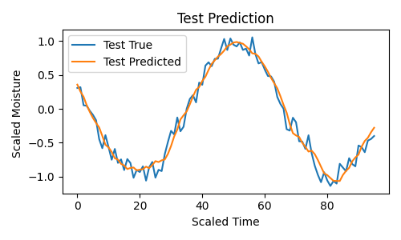

# LSTM-based Time Series Predictor for IoT Plant Watering System 🌱

This part of our project demonstrates a simple yet effective LSTM-based time series prediction model built using PyTorch. It is trained on synthetic sine wave data to mimic sensor trends and can be easily adapted for real-world scenarios like soil humidity monitoring.

## 💡 Use Case

This model is intended for integration into our **IoT-based smart plant watering system**. By predicting future soil moisture levels, it can **automatically trigger watering events** to maintain optimal humidity and avoid over/under-watering.

## 🔧 How it works

- A synthetic sine wave dataset simulates continuous time-series data (like soil humidity levels).
- The data is processed into sliding windows to learn temporal patterns.
- A PyTorch LSTM model is trained to forecast the next value in the series.
- Visualization tools help compare the model’s predictions against actual data.
- The dataset and model can be saved/loaded for deployment in IoT pipelines.

## 🧠 Model Architecture

- **Input**: Past `N` time steps of sensor readings (e.g., humidity)
- **LSTM Layer**: Captures temporal dependencies
- **Linear Layer**: Outputs next predicted value
- **Loss**: Mean Squared Error (MSE)
- **Optimizer**: Adam

## 📦 Files

- `model.py`: Main script for training/testing the LSTM model
- `aritificial_timeseries_data.npz`: Saved time series dataset
- `README.md`: You're reading it :)
  
## 🚀 Future Work

- Replace sine wave with real soil humidity data from IoT sensors
- Add thresholds to trigger watering events automatically based on predictions

## 📸 Sample Output

Graphs show model predictions closely following training and test data trends.

---

